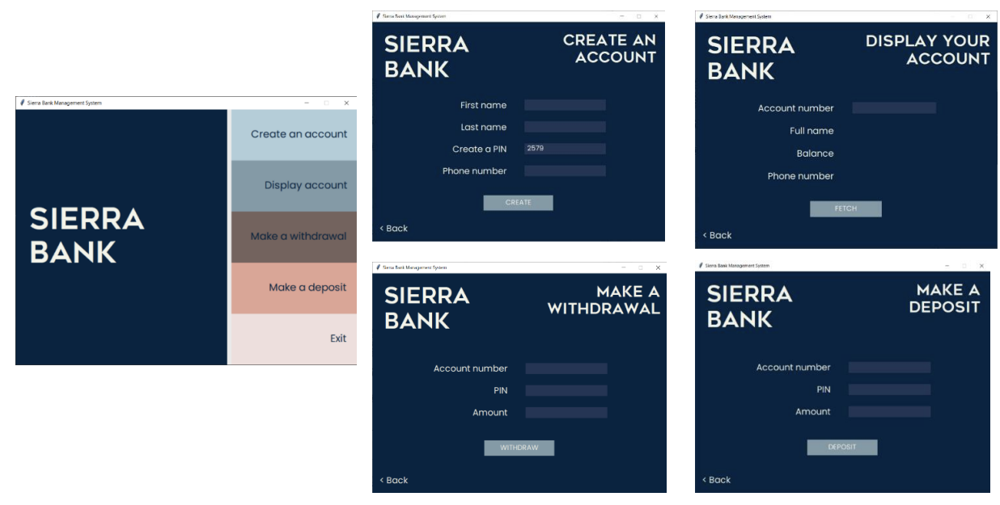

## Key Modules
#### Tkinter
It is the standard Python interface to the Tk GUI toolkit and is Python's de facto standard GUI. Tkinter is included with standard Linux, Microsoft Windows and Mac OS X installs of Python. The name Tkinter comes from Tk interface.

#### mysql.connector
`mysql-connector-python` is a standardized database driver provided by MySQL. MySQL Connector/Python supports almost all features provided by MySQL version 5.7. It allows you to convert the parameter's value between Python and MySQL data types.

cd into the directory and run the script as you would any regular python script. <br>
<i>Note: you need to enter `your mysql password` into the `main.py` scipt
```
cd Sierra-Bank
python main.py
```
The interface should open up, and be ready to use.

## Features


#### Create an account
- Straight forward way to create your account, by entering your details
- A random pin is generated if you can't think of a pin of your own
- Informs you of your account details, post creation, which you will need to make deposits and withdrawls, or to check balance. Also informs you to make a note of it.

#### Display account
- Shows account details from account number, such as name, balance, and phone number.

#### Make a withdrawal
- Simulates the action by taking the amount as a user input.
- Performs a check for validity on the data entered.
- Needs account number and pin to verify user.

#### Make a deposit
- Simulates the action by taking amount deposited as user input instead of auto-counting.
- Performs a check for validity on the data entered.
- Needs account number and pin to verify user.


## Future scope / to do
- PIN handling needs to be made more secure
- Linkage to remote a database, so it can be accessed from anywhere
- More flexible functionalities, like:
	- being able to delete accounts
	- being able to edit details after the creation of an account
	- Possibly a web interface, with more interactive and dynamic elements.
- A more detailed information system, with more inputs from the user
